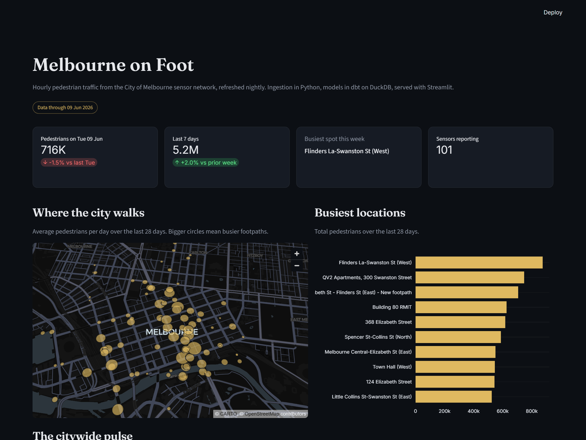

# Melbourne on Foot

Melbourne has been counting footsteps since 2009. Sensors above street corners across the CBD log how many people walk past every hour, and the city publishes the feed as open data. This project takes that feed end to end: a Python ingestion pipeline, a DuckDB warehouse modelled with dbt, and a Streamlit dashboard on top, refreshed nightly by GitHub Actions.



## Architecture

```
City of Melbourne Open Data API (Opendatasoft Explore v2.1)
   |
   |  pipeline/ingest.py
   |  incremental pull, one Parquet partition per month
   v
data/raw/ ............ raw layer, rebuilt from the API, never committed
   |
   |  dbt build (transform/)
   |  staging views, tested marts
   v
data/warehouse.duckdb . DuckDB warehouse, local only
   |
   |  pipeline/export_marts.py
   v
data/marts/ .......... three small Parquet files, committed to the repo
   |
   |  app/streamlit_app.py
   v
Streamlit dashboard ... reads only the marts, deploys anywhere
```

`python run_pipeline.py` runs the three stages in order.

## Design decisions

**Bulk exports over paged records.** The Opendatasoft records API caps out at 100 rows per call. The exports endpoint streams a whole filtered dataset in one request, so a month of data is one HTTP call instead of a thousand.

**Monthly partitions, replaced whole.** Each refresh re-downloads every month touched by the last 7 days (sensor readings can arrive late) and swaps the partition file atomically. Reruns are idempotent and there is no dedupe bookkeeping in the ingestion layer. Staging still enforces one row per observation id as a safety net.

**The warehouse is disposable.** Raw data and the DuckDB file are gitignored. Only the dbt marts get committed, about 700KB of Parquet covering two years of data from 136 sensors (1.6M hourly readings). The deployed dashboard needs nothing but those three files, so it runs on Streamlit Community Cloud's free tier with no database to host.

**Trust the data, not the calendar.** The newest day in the feed is usually still filling in. The dashboard anchors on the latest day with near-complete sensor coverage instead of blindly using yesterday, which avoids a misleading 99 percent drop in the headline numbers.

**Tests live in dbt.** Uniqueness on observation ids, accepted ranges on hours and counts, referential integrity from facts to the sensor dimension. `dbt build` runs models and tests together, and the nightly refresh fails loudly if the source data goes weird.

## Data models

| Model | Grain | Purpose |
|---|---|---|
| `stg_counts` | one row per sensor hour | typed, deduplicated source data |
| `stg_sensors` | one row per location | typed sensor reference |
| `fct_hourly_counts` | one row per sensor hour | calendar enrichment, base for marts |
| `dim_sensors` | one row per location | coordinates, status, activity bounds |
| `mart_daily_location` | one row per location day | trends, rankings, the map |
| `mart_hourly_profile` | location x weekday x hour | heatmap and hourly profiles, trailing 90 days |

## Running it yourself

```
python -m venv .venv
.venv\Scripts\activate
pip install -r requirements.txt -r pipeline/requirements.txt
python run_pipeline.py
streamlit run app/streamlit_app.py
```

The first run backfills the full two year window, around 25 API calls and a couple of minutes. After that, runs only touch the trailing week. The dashboard works straight away even without running the pipeline, since the marts are committed.

## Refresh schedule

A GitHub Actions workflow runs the pipeline at 3:30am Melbourne time, after the previous day's counts land. If the marts changed, it commits them, which triggers a redeploy of the dashboard.

## Data source

[Pedestrian Counting System, City of Melbourne](https://data.melbourne.vic.gov.au/explore/dataset/pedestrian-counting-system-monthly-counts-per-hour/information/), licensed CC BY 4.0. The API serves a rolling two year window of hourly counts. Counts are sensor readings, not exact footfall.
